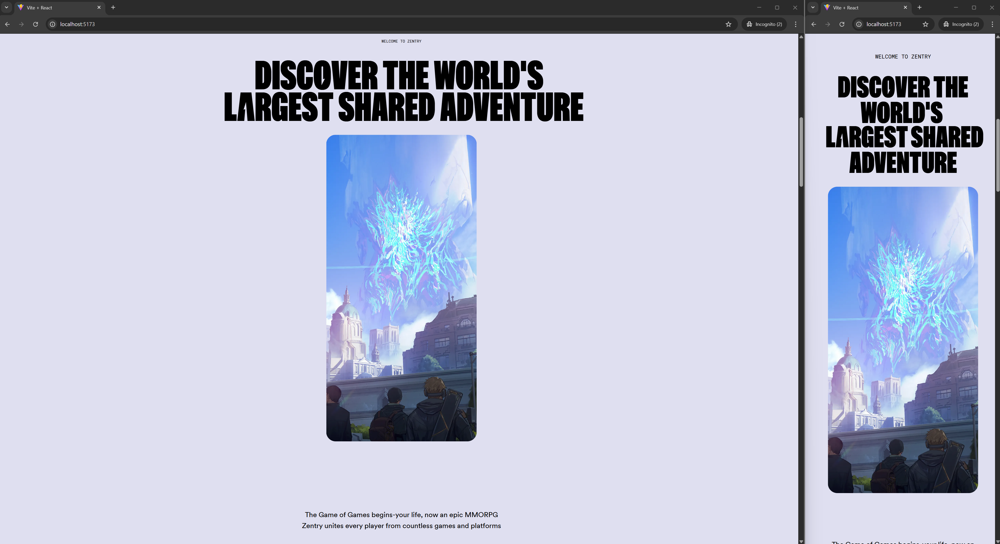
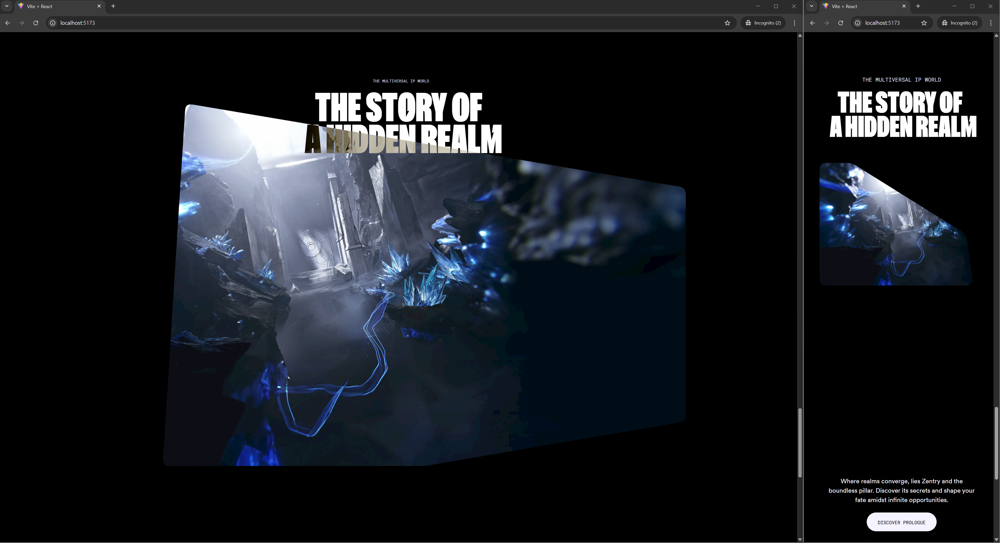
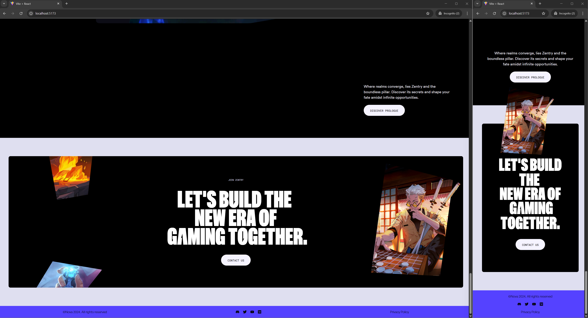

# 🚀 Zentry Clone Webpage

A visually dynamic and interactive clone of the **Zentry** website, built step-by-step with guidance from **JavaScript Mastery**. This project combines **scroll-triggered animations, geometric transitions, and engaging video storytelling** to create an immersive user experience.

## ✨ Features

- 🎭 **Scroll-Triggered Animations** — Animations dynamically activate as users scroll.
- 📐 **Geometric Transitions** — Smooth shape-based transitions enhance the design.
- 🎥 **Engaging Video Storytelling** — Integrated videos provide an interactive experience.
- 🖱️ **3D Hover Effects** — Elements react to user interaction with depth and motion.
- 📱 **Fully Responsive** — Adapts seamlessly to different screen sizes and devices.

## 🛠️ Built With

- [React](https://reactjs.org/)
- [Tailwind CSS](https://tailwindcss.com/)
- [GSAP (GreenSock Animation Platform)](https://greensock.com/gsap/)
- [Vite](https://vitejs.dev/)

## 📸 Preview

### 🔄 Hero

### 📐 About

### 🎥 Feature

### 🖱️ Story

### 📱 Contact

